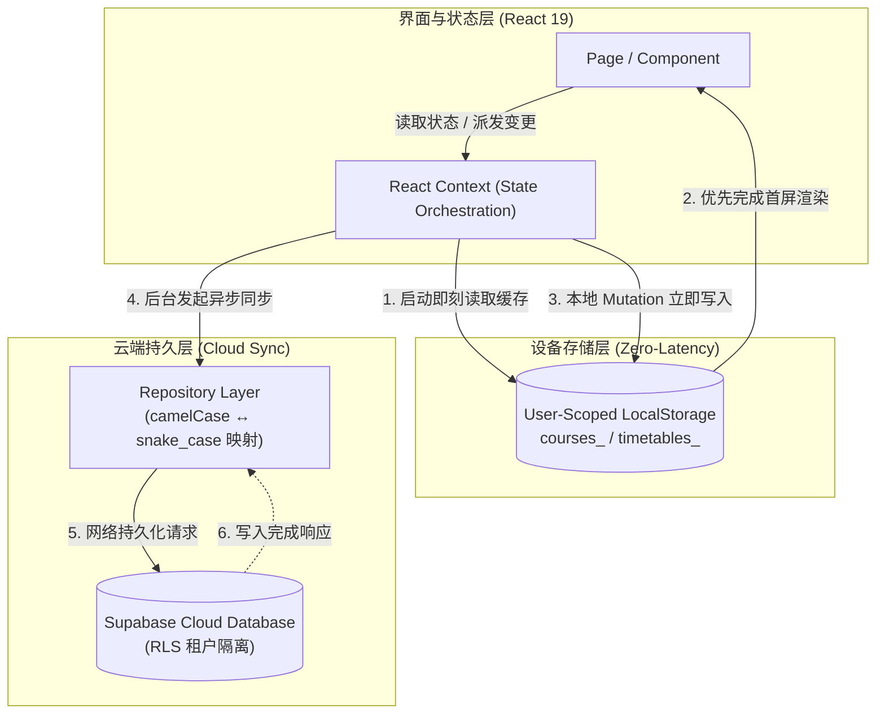
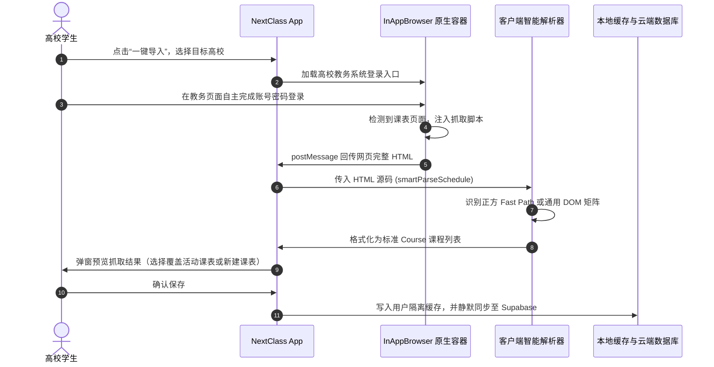

<div align="center">

  

  <br />
  <br />

  <h1>NextClass</h1>

  <p>
    <strong>你的专属课表与教务管家</strong>
    <br />
    告别繁琐的教务系统。一键全自动抓取课表，极其纯净的无广体验，专为大学生定制。
  </p>

  <p>
    <a href="https://github.com/yanyihang621-art/NextClass"></a>
    <a href="https://nextclass.top"></a>
    <a href="#-快速开始-run-locally"></a>
    
    
    
    
    
  </p>

  <p>
    <a href="#-核心特性"><strong>核心特性</strong></a> ·
    <a href="#-界面预览"><strong>界面预览</strong></a> ·
    <a href="#-系统架构与设计"><strong>系统架构</strong></a> ·
    <a href="#-快速开始-run-locally"><strong>快速开始</strong></a> ·
    <a href="#-android-构建与打包"><strong>Android 打包</strong></a> ·
    <a href="https://nextclass.top"><strong>官方网站</strong></a>
  </p>

</div>

---

## 📖 项目简介

**NextClass** 是一款面向中国大陆高校学生的**移动优先（Mobile-First）现代课表与日程管理应用**。同一套核心 Web 代码同时作为现代 PWA，并由 Capacitor 8 封装为 Android 原生 App。

在当今高校生活中，传统教务系统往往界面陈旧、移动端加载缓慢且排版混乱；而市面主流课表应用又充斥着开屏广告、营销推广与臃肿复杂的社交信息流。

**NextClass 坚持“只做课表该做的事”**：
- 🌿 **纯净体验**：零开屏广告、零社交动态、零冗余弹窗，打开即见当下安排。
- 🚀 **一键教务抓取**：内置安全 InAppBrowser 与智能解析引擎，登录教务系统一键导入整学期课表。
- ⚡ **离线优先架构（Offline-First）**：基于用户隔离的本地毫秒级缓存，弱网、断网不白屏，课表秒开无延迟。
- 🎨 **自由个性定制**：圆角曲率、单元格高度、卡片透明度与多套高颜值主题色自由调节。

---

## 📱 界面预览

<div align="center">
  
  <p><em>NextClass 官方宣发页与真实 App 课表网格界面</em></p>
</div>

---

## ✨ 核心特性

| 模块 | 特性与优势 |
| :--- | :--- |
| 🎓 **智能教务导入** | 移动端原生集成 WebView 安全桥接，支持正方等主流高校教务系统一键抓取；客户端自动解析课程、上课周次与节次作息，无需手动逐项录入。 |
| 🌿 **纯粹无广告** | 告别开屏倒计时与各类商业信息流；界面聚焦在课表日程与基础设置，操作丝滑顺畅。 |
| ⚡ **毫秒级离线首屏** | 采用用户空间隔离的 `localStorage` 缓存机制，冷启动优先读取缓存渲染，后台静默与 Supabase 同步，即使在地下室、电梯等弱网环境依然稳定秒开。 |
| 📅 **智能今日日程 (Agenda)** | 结合开学日期与当前周次，动态计算单双周与今日课程安排；醒目标注当前课程进行状态、上课教室与上下课节次倒计时。 |
| 🎨 **高度个性化审美** | 针对现代全面屏定制，提供圆角/方角弧度、单元格高度、透明度调节，以及紫罗兰、海盐蓝、薄荷绿等多种精致清新配色。 |
| ☁️ **云端跨设备同步** | 接入 Supabase 现代云端数据库，数据与认证账号绑定，支持多学期课表独立创建、自由切换与云端多端持久化。 |
| 📱 **原生级交互体验** | 借助 Capacitor 8 深度封装，适配 Android 系统级全面屏边缘手势（返回上一页）、状态栏沉浸穿透以及标准 Safe Area 布局。 |

---

## 🏗️ 系统架构与设计

### 1. 运行时结构与依赖流

应用的运行时状态由统一的 React Context 分层管理，并在启动阶段同步恢复：

```text
ErrorBoundary
└─ AuthProvider              # 身份认证与登录态保持 (nextclass_cached_auth_user)
   └─ PreferencesProvider    # 设备级外观设置 (主题色、圆角、行高、透明度)
      └─ TimetableProvider   # 课表配置边界 (学期、开学日、节次安排、活动课表切换)
         └─ CourseProvider   # 课程数据与周次过滤 (Course 实体与本地/云端同步)
            └─ BrowserRouter # 客户端路由与页面流转
```

### 2. 离线优先数据流架构 (Offline-First)

采用 **本地缓存先于网络渲染** 的离线策略，确保用户界面零延迟响应：



### 3. 教务课表一键抓取流程



---

## 🛠️ 技术选型矩阵

| 技术层级 | 选型组件 | 描述与版本 |
| :--- | :--- | :--- |
| **前端框架** | React 19 + TypeScript 5.8 | 现代组件模型、严格类型约束与高性能渲染引擎 |
| **构建工具** | Vite 6 | 秒级冷启动开发服务器与极速 Rollup 生产打包 |
| **样式与动效** | Tailwind CSS 4 + Motion | 现代原子化 CSS 引擎、流动性原生转场与手势反馈 |
| **原生封装** | Capacitor 8 | 官方最新内核，无缝将 Web 应用封装为 Android 原生工程 |
| **Android 工程** | Gradle 9.3 + AGP 9.1 + Java 21 | Target SDK 36 (Android 14/15/16 深度适配)，兼顾低版本 SDK 24+ |
| **后端持久化** | Supabase (Postgres + Auth) | 开源后端服务，支持邮箱安全认证与 Row-Level Security 租户数据隔离 |
| **网络代理** | Vercel Serverless Proxy | 生产流量通过 `/sb/*` 代理转发，保证国内网络稳定访问与 CORS 规避 |

---

## 🚀 快速开始 (Run Locally)

### 前置环境准备

- **[Node.js](https://nodejs.org/)**: 建议 `v20.x` 或以上版本
- **npm**: Node 自带包管理工具
- *(可选，仅用于编译 Android APK)*:
  - **JDK**: 推荐 Java 21 (Temurin / OpenJDK)
  - **Android SDK**: Compile / Target SDK 36
  - **Android Studio**: 最新稳定版本

---

### 1. 克隆项目仓库

```bash
git clone https://github.com/yanyihang621-art/NextClass.git
cd NextClass
```

### 2. 安装项目依赖

```bash
npm install
```

### 3. 配置环境变量 (可选)

NextClass 支持离线使用，若需调试云端登录与多端同步，可在项目根目录创建 `.env` 文件：

```ini
VITE_SUPABASE_URL=https://your-project.supabase.co
VITE_SUPABASE_ANON_KEY=your-publishable-anon-key
```

> ⚠️ **安全须知**：前端与客户端代码仅可使用 Publishable / Anon Key，**切勿**将 Service-Role Key 写入前端代码或提交到 Git 仓库。

### 4. 启动本地开发服务

```bash
npm run dev
```

本地服务将在 [http://localhost:3000](http://localhost:3000) 启动。

> 💡 **移动端模拟调试建议**：NextClass 采用移动优先设计（最大外壳宽度为 480px）。在浏览器中按 `F12` 开启开发者工具，切换到手机设备模拟模式（如 Pixel 7 或 iPhone 14 Pro），可获得最真实的交互与手势体验。

---

## 🧪 验证与质量矩阵

在提交代码前，请运行以下验证命令确保代码质量与离线缓存逻辑健全：

```bash
# 1. TypeScript 类型静态检查
npm run lint

# 2. Auth 启动离线缓存不变量校验
npm run verify:startup-cache

# 3. 生产打包验证
npm run build

# 4. 本地生产包预览
npm run preview
```

---

## 📦 Android 构建与打包

NextClass 使用 Capacitor 8 管理 Android 原生工程（位于 `android/` 目录）：

### 1. 将 Web 产物同步至 Android 工程

```bash
npm run build
npx cap sync android
```

### 2. 编译生成 Debug APK

你可以通过 Gradle 快速构建调试版安装包：

```powershell
# Windows PowerShell
cd android
.\gradlew.bat assembleDebug
```

编译生成的 APK 位于：  
`android/app/build/outputs/apk/debug/app-debug.apk`

### 3. 在真机或模拟器运行

如果你已配置好 Android 环境变量，也可直接在连接的真机或模拟器上启动：

```bash
npx cap run android
```

---

## 🔒 隐私与安全性保障

1. **教务凭证零触碰**：学生登录教务系统的全过程均在原生安全 WebView 实例内进行。NextClass 仅提取登录成功后渲染出的课表 HTML 结构，**绝不记录、拦截或向远端发送学生的教务账号与密码**。
2. **多租户安全隔离**：云端数据库严格采用 Supabase Postgres 行级安全机制（RLS），保证每个用户仅能读写自身 UID 绑定的课表与课程。
3. **校园局域网网络兼容**：为兼容部分高校尚未升级 HTTPS 的校园内网教务系统，Android 客户端网络安全配置做了针对性放行与 CA 信任兼容，确保在各种复杂的校园网络环境中稳定解析。

---

## 🤝 参与贡献

欢迎广大高校师生与开发者共同完善 NextClass，支持更多高校的教务解析：

1. **Fork** 本仓库并创建分支 (`git checkout -b feature/amazing-feature`)
2. 提交你的代码 (`git commit -m 'feat: 增加对 XX 大学新版教务系统的解析支持'`)
3. 推送分支到你的远程仓库 (`git push origin feature/amazing-feature`)
4. 发起 **Pull Request**

---

## 📄 开源协议

本项目基于 [MIT License](LICENSE) 开源。

<br />

<div align="center">
  <sub>Made with 💜 for university students across China.</sub>
</div>
