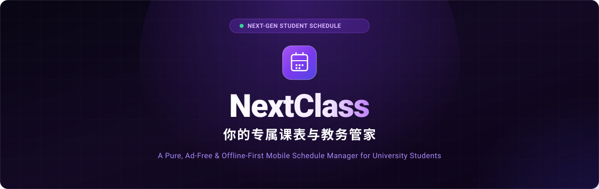
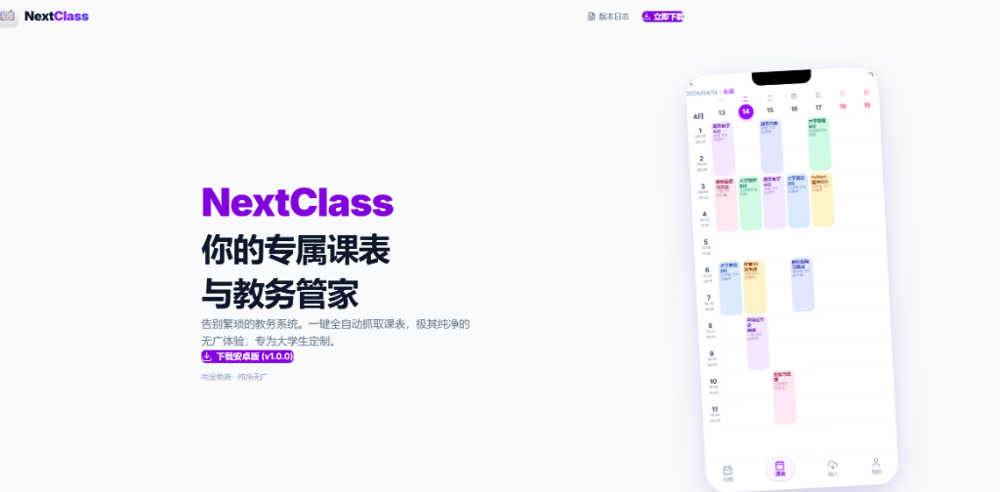
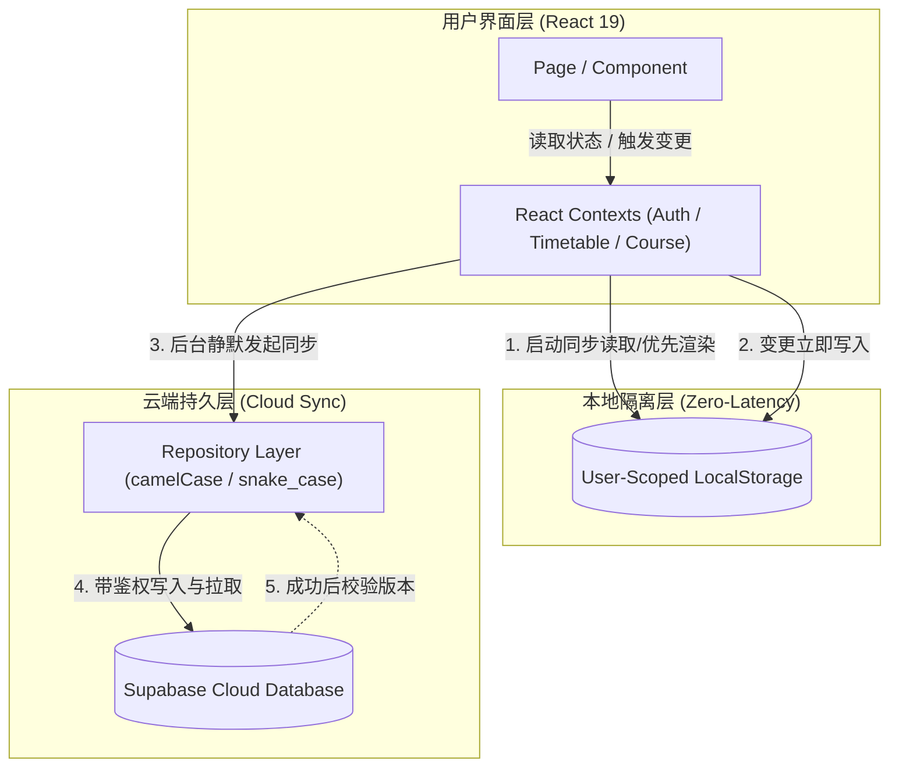
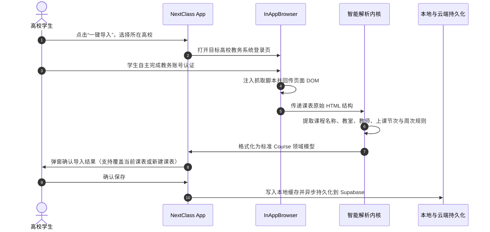

<div align="center">

  

  <br />
  <br />

  <h1>NextClass</h1>

  <p>
    <strong>你的专属课表与教务管家</strong>
    <br />
    告别繁琐教务系统。一键抓取课表，纯净无广，面向大学生。
  </p>

  <p>
    <a href="https://nextclass.top"></a>
    <a href="#-快速开始-run-locally"></a>
    
    
    
    
    
  </p>

  <p>
    <a href="#-核心特性"><strong>探索特性</strong></a> ·
    <a href="#-界面预览"><strong>界面预览</strong></a> ·
    <a href="#-架构与工作区"><strong>技术架构</strong></a> ·
    <a href="#-快速开始-run-locally"><strong>本地运行</strong></a> ·
    <a href="https://nextclass.top"><strong>官方网站</strong></a>
  </p>

</div>

---

## 📖 项目简介

**NextClass** 是一款面向中国大陆大学生的**课表与日程管理APP**。

在校园生活中，高校教务系统往往界面陈旧、排版体验欠佳，登录验证繁琐；而市面上的许多课表软件充斥着开屏广告、与臃肿的功能。

**NextClass 为纯净与效率而生**：
- **只做课表该做的事**：拒绝弹窗、拒绝后台冗余推送。
- **一键全自动抓取**：登录教务系统一键解析抓取，整学期课程瞬时同步。
- **离线优先设计**：无惧阶梯教室弱网断网，快速直出课表。
- **丝滑交互体验**：提供平滑手势、圆角/行高/透明度可调节的课表网格，及多套主题色。

---

## 📱 界面预览

<div align="center">
  
  <p><em>NextClass 官方宣发页与 App 真实课表视图</em></p>
</div>

---

## ✨ 核心特性

| 模块 | 特性说明 |
| :--- | :--- |
| 🎓 **教务一键抓取** | 移动端原生集成 WebView 安全桥接，支持正方等主流高校教务系统一键抓取；客户端智能解析课程与节次规则，不托管用户教务密码，保护学生账号隐私。 |
| 🌿 **纯净无广告** | 告别臃肿的开屏倒计时、理财借贷推广与冗余社交圈；界面仅保留课程、日程、导入与必要偏好，打开即是当下安排。 |
| ⚡ **离线优先首屏** | 采用用户空间隔离的 `localStorage` 缓存机制，课表数据瞬时可见，弱网或离线绝不白屏；后台静默与云端同步，不阻塞 UI 渲染。 |
| 📅 **智能日程视图** | 根据当前周次、单双周及教学作息时间智能计算“今日课程” Agenda，直观呈现课程进度、上课教室与上下课节次倒计时。 |
| 🎨 **个性化审美定制** | 支持自由调节课表单元格高度、卡片圆角方角曲率、网格透明度与多套精心调配的主题配色（紫罗兰、海盐蓝、薄荷绿等）。 |
| ☁️ **云端跨端持久化** | 基于 Supabase 认证体系与云端持久化，支持多学期课表创建、切换与管理，随时保障课程数据安全不丢失。 |
| 📱 **跨端工程架构** | 采用一套核心 Web/PWA 代码，结合 Capacitor 8 深度封装为 Android 原生 App，全面适配现代全面屏安全区域与边缘系统返回手势。 |

---

## 🏗️ 架构与工作区

本项目采用清晰的多子工程体系，职责分明、独立演进：

```text
NextClass-Workspace/
├── NextClass/             # 核心 App 仓库（Web / PWA / Android 原生 Capacitor 工程）
│   ├── src/               # React 19 + TypeScript 应用源码（Contexts, Repositories, Pages）
│   ├── android/           # Capacitor 原生 Android 工程（SDK 36, Java 21, InAppBrowser）
│   └── public/            # PWA Manifest 与静态图标
├── NextClass-Landing/     # 官方宣发与下载站（React 19 + Tailwind CSS 4）
│   ├── src/               # 宣发站组件（Hero, Features, Changelog, PhoneMockup）
│   └── public/            # NextClass.apk 官方发布包分发与网站资产
└── assets/                # README 视觉资产（Banner & Preview）
```

### 离线优先数据流架构



### 课表抓取与导入流程



---

## 🛠️ 技术栈

| 分类 | 核心技术 | 详细说明 |
| :--- | :--- | :--- |
| **应用前端** | React 19, TypeScript 5.8, Vite 6 | 前沿 React 核心，极速 HMR 构建，类型安全 |
| **样式与动效** | Tailwind CSS 4, Motion (`framer-motion`) | 现代化原子化样式引擎，流畅的原生级转场过渡 |
| **原生能力** | Capacitor 8, Android SDK 36 | 原生沉浸式状态栏适配、Safe Area 布局与 InAppBrowser |
| **后端与认证** | Supabase JS, Postgres, RLS | 邮箱身份验证、Row Level Security 租户隔离数据持久化 |
| **离线与缓存** | User-Scoped LocalStorage, Service Worker | 用户身份隔离的秒开缓存，离线首屏保证 |
| **官方宣发** | React 19, Tailwind CSS 4, Lucide React | 极简、高转化、响应式客户端单页，支持动态读取更新日志 |

---

## 🚀 快速开始 (Run Locally)

### 环境要求

- [Node.js](https://nodejs.org/) (推荐 `v20.x` 或以上)
- `npm` 或兼容的包管理工具
- *(可选，用于编译 Android 原生包)*: Android Studio, JDK 21, Android SDK 36

### 1. 克隆仓库

```bash
git clone https://github.com/yanyihang621-art/NextClass.git
cd NextClass
```

---

### 2. 运行 NextClass 移动端 App (Web/PWA)

进入 `NextClass` 目录，安装依赖并启动本地开发服务器：

```bash
cd NextClass
npm install
npm run dev
```

本地服务启动后，在浏览器访问 [http://localhost:3000](http://localhost:3000)。

> **开发小贴士**：NextClass 采用移动优先设计，建议按 `F12` 打开浏览器开发者工具，并切换至**手机模拟模式（如 iPhone 14 / Pixel 7）**以获得最佳视图体验。

#### 环境变量配置 (可选)

在 `NextClass/` 根目录创建 `.env` 文件以连接您自己的 Supabase 实例：

```ini
VITE_SUPABASE_URL=https://your-project.supabase.co
VITE_SUPABASE_ANON_KEY=your-anon-key
```

#### 构建生产产物

```bash
npm run build
npm run preview
```

---

### 3. 运行 NextClass Landing (官网宣发站)

进入 `NextClass-Landing` 目录，启动官方宣发主页：

```bash
cd NextClass-Landing
npm install
npm run dev
```

本地服务将在 `http://localhost:5173`（或 Vite 分配的端口）启动，可预览完整的产品介绍、手机模型展示与版本日志。

---

### 4. 构建 Android 原生 APK

如果您希望为 Android 手机打包原生安装包：

```bash
cd NextClass

# 1. 构建 Web 生产包并同步至原生 Android 工程
npm run build
npx cap sync android

# 2. 编译生成 Debug APK
cd android
./gradlew.bat assembleDebug
```

编译生成的 APK 位于：  
`NextClass/android/app/build/outputs/apk/debug/app-debug.apk`

---

## 🔒 隐私与安全性设计

1. **教务凭证零留存**：学生登录教务系统的过程完全在本地安全的 WebView 容器中完成，NextClass 仅提取渲染后的课表 HTML 结构，**绝不记录、抓取或向云端上传学生的教务登录账号与密码**。
2. **租户数据隔离**：云端数据库依托 Supabase 的行级安全策略（Row-Level Security, RLS），每一位用户的课表与课程数据均受独立 UID 强力保护，保障数据隔离与传输安全。
3. **明文与校园局域网兼容**：为适配部分高校尚未普及 HTTPS 的校园内网教务系统，Android 客户端针对校园网络环境做好了安全信任与网络连通性兼容。

---

## 🤝 参与贡献

我们非常欢迎高校同学与开发者共同改进 NextClass！

1. **Fork** 本仓库
2. 创建您的特性分支 (`git checkout -b feature/amazing-feature`)
3. 提交您的修改 (`git commit -m 'feat: 增加对 XX 大学新版教务系统的解析支持'`)
4. 推送到分支 (`git push origin feature/amazing-feature`)
5. 提交 **Pull Request**

---

## 📄 开源协议

本项目基于 [MIT License](LICENSE) 协议开源。

<br />

<div align="center">
  <sub>Made with 💜 for university students across China.</sub>
</div>
